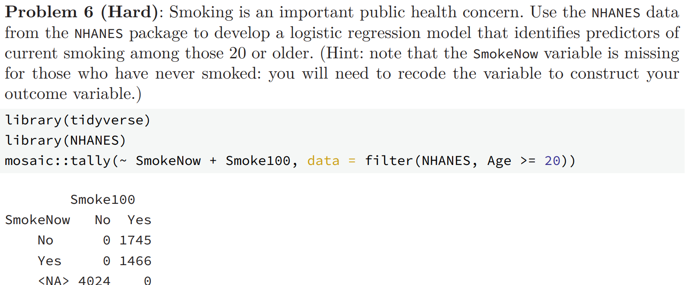

```{r setup, include=FALSE}
knitr::opts_chunk$set(echo = TRUE, eval = TRUE, warning = FALSE, message = FALSE, fig.width=6, fig.height=4, out.width = "70%", fig.align = "center", python.reticulate = TRUE)  
options(knitr.table.format = "html")
# reticulate::use_condaenv(condaenv = "env_26", conda = "~/miniconda3/condabin/conda") # git 올릴 때 지움..
```

## 지시사항

제출마감 2026-06-15 23:00

1.	R과 Python을 모두 사용하여 사용된 코드와 데이터랭글링 절차, 분석결과를 설명한다. 두 언어의 분석결과가 차이가 있으면 그 이유를 설명한다.
2.  [Quarto Markdown](https://quarto.org/docs/authoring/markdown-basics.html)을 사용한다. 제공된 숙제 `.qmd` 파일에 본인의 답안을 "답안" 절에 추가하여 제출한다. Quarto Markdown은 RStudio 또는 Visual Studio Code에 [Quarto Extension](https://marketplace.visualstudio.com/items?itemName=quarto.quarto)을 추가하여 컴파일, 다른 문서 형식으로 변환할 수 있다. 
3.  R의 `reticulate` 패키지를 사용하면 하나의 `.qmd` 파일 안에서 R과 Python을 동시에 사용할 수 있다. 이때 다음 문법을 사용하여 두 언어 코드를 탭으로 구분한다.  숙제 `.qmd` 파일은 `reticulate`을 사용하도록 준비되어 있다.

````
::: {.panel-tabset}

## R

```{{r}}
R code
```

## Python

```{{python}}
Python code
```

:::

````

3.  `.qmd`를 컴파일하여 생성된 `.html` 파일을 함께 저장소에 제출한다.
4.  함께 제공된 `student.yml`을 함께 작성하여 저장소에 제출한다.

## 평가 기준

1.  재현성: 제출된 저장소의 `.qmd` 파일을 컴파일하여 함께 제출된 `.html` 파일과 동일한 결과가 나와야 한다.
2.	분석의 정확성: 분석은 올바른 기술적 세부 사항을 포함하여 수행되어야 한다.
3.	보고서의 전반적인 품질: 데이터 가공 및 분석 결과가 명확하고 자세하게 설명되어야 한다.
4.	코드의 전반적인 품질: 코드는 체계적으로 정리되어 있어야 하며, 가독성을 높이기 위해 적절한 주석이 포함되어야 한다.

#### **늦게 제출된 과제물은 받지 않는다.**


#### 과제 환경

본 과제가 작성된 환경이다.

::: {.panel-tabset}

## R
```{r}
library(tidyverse)
library(MASS)
library(NHANES)
library(Lahman)
library(boot)

sessionInfo()
```

## Python
```{python}
import session_info
import numpy as np
import pandas as pd
import polars as pl
import statsmodels.api as sm
import statsmodels.formula.api as smf
import matplotlib
matplotlib.use("Agg")
import matplotlib.pyplot as plt
from plotnine import *
from scipy.optimize import curve_fit
from scipy.stats import t, chi2, norm, bootstrap, rankdata
from statsmodels.stats.outliers_influence import variance_inflation_factor
from collections import Counter
import pylahman

session_info.show()
```

:::


# 1부  교과서 연습문제

## 문제 1-1

1. MDSR 10장 연습문제 10.6.6


### 답안

우선 문제에서 제시한 `NHANES` 데이터셋을 불러온다:

::: {.panel-tabset}
## R
```{r}
nhanes_adult <- NHANES %>% filter(Age >= 20)

nhanes_adult %>% summarise(
    smoke100_na = sum(is.na(Smoke100)),
    no_but_now_yes = sum(Smoke100 == "No" & SmokeNow == "Yes", na.rm = TRUE)
  ) 
```

## Python
```{python}
NHANES = pl.from_pandas(r.NHANES)

nhanes_adult = NHANES.filter(pl.col("Age") >= 20)

nhanes_adult.select([
    pl.col("Smoke100").is_null().sum().alias("smoke100_na"),
    ((pl.col("Smoke100") == "No") & (pl.col("SmokeNow") == "Yes")).sum().alias("no_but_now_yes")
])
```

:::

문제가 이야기한 것과 같이 20세 이상의 데이터 중에는 `Smoke100` 결측이 존재하지 않으며, `Smoke100`이 "No"인 경우에는 `SmokeNow`가 "Yes"인 경우가 없음을 확인할 수 있다. 
이제 회귀에 적합한 변수를 고른다

::: {.panel-tabset}
## R
```{r}
names(nhanes_adult)
```

## Python
```{python}
nhanes_adult.columns
```

:::

중복되는 변수들 (`Age`, `AgeDecade`, `AgeMonths`) 중 하나만 남기고, 결측치가 많은 변수(`TvHrsDay`)가 유사한 다른 변수(`PhysActiveDays`)로 대체될 수 있을 경우, 무의미한 변수(`ID`) 등을 제외하고, 다음 변수들을 고려하자:
"Gender", "Age", "Race1", "Education", "MaritalStatus", 
  "Poverty", "Work", "BMI", "BPSysAve", "BPDiaAve", "DirectChol", 
  "TotChol", "Diabetes", "HealthGen", "Depressed", "SleepHrsNight", 
  "PhysActive", "AlcoholYear", "Marijuana", "HardDrugs"

마지막으로 베르누이 분포로 검정이 가능하도록 `smoke_current`를 통합해 만들자. 현재 흡연 시 1, 비흡연 시 0의 값을 갖도록 만든다. 또한 회귀에 적합한 변수들을 고른다.


::: {.panel-tabset}
## R
```{r}
selected_vars <- c(
  "Gender", "Age", "Race1", "Education", "MaritalStatus", 
  "Poverty", "Work", "BMI", "BPSysAve", "BPDiaAve", "DirectChol", 
  "TotChol", "Diabetes", "HealthGen", "Depressed", "SleepHrsNight", 
  "PhysActive", "AlcoholYear", "Marijuana", "HardDrugs"
)

nhanes_smoke <- nhanes_adult %>% 
    mutate(smoke_current = case_when(
        Smoke100 == "No"  ~ 0L, 
        SmokeNow == "Yes" ~ 1L, 
        SmokeNow == "No"  ~ 0L)) %>% 
    dplyr::select(all_of(selected_vars), "smoke_current") %>%
    drop_na()

nhanes_smoke %>% glimpse()
```

## Python
```{python}
selected_vars = [
    "Gender", "Age", "Race1", "Education", "MaritalStatus", 
    "Poverty", "Work", "BMI", "BPSysAve", "BPDiaAve", "DirectChol", 
    "TotChol", "Diabetes", "HealthGen", "Depressed", "SleepHrsNight", 
    "PhysActive", "AlcoholYear", "Marijuana", "HardDrugs"
]

nhanes_smoke = (nhanes_adult.with_columns([
    pl.when(pl.col("Smoke100") == "No").then(0)
    .when(pl.col("SmokeNow") == "Yes").then(1)
    .when(pl.col("SmokeNow") == "No").then(0)
    .alias("smoke_current")
    ]).select(selected_vars + ["smoke_current"])
    .drop_nulls()
)

nhanes_smoke.glimpse()
```

:::

문제 요구에 따라 binomial with weight 1(Bernoulli)로 로지스틱 검정을 시행하고, AIC step으로 고른다. python의 경우 AIC step 없이, 전체 모델의 AIC값만을 구해 R과 비교하도록 하자.

::: {.panel-tabset}
## R
```{r}
smoke_full <- glm(smoke_current ~ ., family = binomial, data = nhanes_smoke)
smoke_step <- MASS::stepAIC(smoke_full, trace = FALSE)

smoke_step %>% summary()
smoke_full %>% AIC()
```

## Python
```{python}
smoke_full = smf.glm("smoke_current ~ " + " + ".join(selected_vars), data=nhanes_smoke.to_pandas(), family=sm.families.Binomial()).fit()

print(smoke_full.summary())
print(f"AIC: {smoke_full.aic}")
```

:::

AIC로 선택된 변수들의 Odds ratio 및 신뢰구간은 다음과 같다.

```{r}
cbind(OR    = exp(coef(smoke_step)),
      lower = exp(confint(smoke_step))[, 1],
      upper = exp(confint(smoke_step))[, 2])
```


포함된 변수들 중 놀랍게도 `Age`와 `Gender`가 빠진다. 이는 다른 변수들이 너무나 강력하거나 큰 상관관계를 보였기 때문으로 추측할 수 있다. 

신뢰구간에 1 배가 포함되는 백인, 미혼, 건강 매우 나쁨과 같은 변수들은 다만 통계적으로 크게 유의하지는 않다.
마리화나 경험, hard drug 경험은 흡연 확률을 크게 높이고, 대졸, 당뇨병 등은 크게 낮춘다. 
이를 비롯해 통계적으로 매우 유의미한($p < 0.001$) 핵심 예측 요인들은 다음과 같다.

사회경제적 요인: 교육 수준이 높을수록(특히 대학교 졸업자), 그리고 빈곤율 지수(Poverty)가 높을수록 흡연 확률이 강력하게 감소하였다.

라이프스타일 및 약물: 마리화나 및 Hard drug 사용 경험은 흡연 확률을 가장 극적으로 높이는 위험 요인이었다. 반면, 규칙적인 신체 활동과 충분한 수면 시간은 흡연을 억제하는 강력한 보호 요인으로 나타났다.

기본 인적 사항 및 건강: 기혼 상태일수록 흡연 확률이 낮았다. 또한 당뇨병 진단을 받았거나 BMI가 높은 경우 오히려 흡연율이 낮게 나타났는데, 이는 건강 악화로 인한 의료적 개입(금연 권고 등)의 결과로 추정된다.

결론적으로 성인의 흡연 여부는 단순한 습관을 넘어, 개인의 사회경제적 지위(학력/소득) 및 타 약물 사용 여부와 가장 깊은 연관성을 가지는 것으로 확인되었다.


# 2부  데이터 분석 실무

### 분석 관련 공통 지침

1.	관측단위(observational unit)는 `playerID`와 `yearID`의 고유한 조합으로 한다. 즉, 데이터프레임의 각 행은 한 선수의 특정 연도에 해당해야 하고(예: 2019년 류현진), 한 선수의 특정 연도가 두 번 이상 나타나서는 안 된다. 이적을 한 경우 원자료에서는 두 번 이상 나타날 수 있으므로 주의해야 한다.
2.	데이터 분석을 하는 중에 필요한 경우 pivoting으로 각 행이 한명의 선수에 해당하는 wide format data를 만들어서 연도간 비교를 하는 것은 허용한다.

#### 공통 분석 (전처리)

공통 지침이 요구한 바와 같이 `playerID`와 `yearID`의 고유한 조합으로 관측단위를 정의하여야 하지만, 이하 문제에서 사용하는 `Teams` 데이터프레임은 `playerID` 없이 이미 team과 year 단위로 한 행이다. 따라서 문제의 공통 분석 지침은 `Teams` 데이터프레임에는 적용되지 않는다.
아래 문제에서 요구한 바와 같이 year는 2010년에서 2025년까지로 제한하되 2020년을 제외하고, 필요한 변수들을 선택하여 새로운 데이터프레임을 만들어 보자.

::: {.panel-tabset}

## R
```{r}
teams_data <- Teams %>%
  filter(yearID >= 2010, yearID <= 2025, yearID != 2020) %>%
  filter(!is.na(R), !is.na(RA), R > 0, RA > 0) %>%
  mutate(decided  = W + L,
         WPct     = W / decided,
         RS       = R,
         logRS    = log(R),
         logRA    = log(RA),
         logRSRA  = log(R) - log(RA),
         logD     = log(decided))

teams_data %>% glimpse()
```

## Python
```{python}
teams_data = (pl.from_pandas(pylahman.Teams())
  .filter((pl.col("yearID") >= 2010) & (pl.col("yearID") <= 2025) & (pl.col("yearID") != 2020))
  .filter((pl.col("R").is_not_null()) & (pl.col("RA").is_not_null()) & (pl.col("R") > 0) & (pl.col("RA") > 0))
  .with_columns([
    (pl.col("W") + pl.col("L")).alias("decided"),
    pl.col("R").alias("RS"),
    pl.col("R").log().alias("logRS"), 
    pl.col("RA").log().alias("logRA"),
    (pl.col("R").log() - pl.col("RA").log()).alias("logRSRA")
  ]).with_columns([
    (pl.col("W") / pl.col("decided")).alias("WPct"),
    pl.col("decided").log().alias("logD")
  ])
)

teams_data.glimpse()
```

:::


## 문제 2-1

Lahman Package의 `Teams` 데이터프레임에서 코로나 시즌인 2020년을 제외한 2010년부터 2025년 사이의 데이터를 이용하여 다음 질문에 답하라. 

1.  MDSR Chapter 7 Iteration 에서 배운 Bill James의 공식을 변형한 다음 모형을 데이터에 적합하고, 모수 $k$의 점추정치와 신뢰구간을 구하라.
$$
  WPct = \frac{RS^k}{S^k+RA^k} = \frac{1}{1+(RA/RS)^k}
$$

2.  회귀계수 $\beta_1$이 위 모형의 $k$와 거의 같은 의미를 가지는 로지스틱 회귀 모형을 세우고 이를 데이터에 적합하라. 모수와 점추정치와 신뢰구간을 구하고 이를 1항의 결과와 비교하라. 

    *주의*: 절편이 없는 모형을 적합해야 함.
    *힌트 1*. 로짓은 $\log〖WPct/(1-WPct)$로 계산됨.
    *힌트 2*. 로짓의 역함수인 sigmoid는 $\frac{1}{1+e^{-x}}$로 계산됨.

3.  2항의 모형 적합 결과에 대한 다음 세가지 진단 중 최소 두가지 이상을 수행하여 모형적합이 잘 되었는지 확인하라.

    i.  Residual Deviance에 대한 해석 (카이제곱 분포와 비교) 
	  ii. Deviance residuals vs linear predictors ($\eta$) 산점도 
	  iii.  관측된 WPct와 모형에서 예측하는 WPct를 산점도 그래프로 비교

4.  `WPct`를 반응변수로, `log(RA)`와 `log(RS)`를 설명변수로 하는 절편이 없는 로지스틱선형회귀 모형을 적합하고 회귀계수들의 추정 결과를 a와 b항의 결과와 비교하라. (유사한 모형을 얻는지 여부 등)


### 답안

#### 1

nls를 이용한 k의 추정치 및 신뢰구간이다

::: {.panel-tabset}
## R
```{r}
m_nls <- nls(WPct ~ 1 / (1 + (RA / RS)^k),
               data = teams_data, start = list(k = 2))
c(coef(m_nls), confint(m_nls))
```

## Python
```{python}
def bj(X, k):
    RA, RS = X
    return 1.0 / (1.0 + (RA / RS) ** k)

popt, pcov = curve_fit(bj, (teams_data["RA"].to_numpy(), teams_data["RS"].to_numpy()),
                       teams_data["WPct"].to_numpy(), p0=[2.0])

k_se = np.sqrt(np.diag(pcov))[0]
ci   = t.interval(0.95, df  = len(teams_data) - 1,
                        loc = popt[0],
                        scale = k_se)
print(f"k = {popt[0]:.4f}  95% CI = ({ci[0]:.4f}, {ci[1]:.4f})")
```

:::

#### 2
$$
\mathrm{WPct}=\frac{\mathrm{RS}^k}{\mathrm{RS}^k+\mathrm{RA}^k}=\frac{1}{1+(\mathrm{RA}/\mathrm{RS})^k}
$$

의 양변을 로짓변환하면, $\mathrm{logit}(\mathrm{WPct})=\log\frac{\mathrm{WPct}}{1-\mathrm{WPct}} = -\log\big((\mathrm{RA}/\mathrm{RS})^k\big)=k\,\log(\mathrm{RS}/\mathrm{RA})$이다. 즉, 로짓이 $\log(\mathrm{RS}/\mathrm{RA})$에 대해 절편 없이 선형이고 그 기울기가 정확히 $k$이므로, $WPct$를 추청하는 로지스틱 모델을 적합해보자.

::: {.panel-tabset}
## R
```{r}
m_logit <- glm(cbind(W, L) ~ logRSRA - 1,
               family = binomial, data = teams_data)

m_logit %>% summary()
c(coef(m_logit), confint(m_logit))
```

## Python
```{python}
m_logit = smf.glm("WPct ~ logRSRA - 1", data=teams_data.to_pandas(),
                  family=sm.families.Binomial(),
                  var_weights=teams_data["decided"].to_numpy()).fit()

ci_logit = m_logit.conf_int().loc["logRSRA"]

print(f"beta_logit: {m_logit.params['logRSRA']:.4f}")
print(f"95% CI: ({ci_logit[0]:.4f}, {ci_logit[1]:.4f})")
```

:::

#### 3
##### i
 $D_M/\phi$는 근사적으로 $\chi^2_{n-p}$이다($\phi=1$). 따라서 해당 값의 p value를 다음과 같이 계산한다. 카이제곱이라면 $D/df$는 기댓값이 $1$이어야 하고, 이보다 작으면 과소산포, 크면 과대산포이다.

::: {.panel-tabset}
## R
```{r}
D <- deviance(m_logit); df <- df.residual(m_logit)
c(D = round(D, 2), df = df, ratio = round(D / df, 3),
  p = round(pchisq(D, df, lower.tail = FALSE), 4))
```

## Python
```{python}
D, df = m_logit.deviance, m_logit.df_resid
print(f"D={D:.2f}  df={df:.0f}  ratio={D/df:.3f}  p={chi2.sf(D, df):.4f}")
```

:::

$D/df\approx0.40\ll1$ 이므로 과소산포이다. 한 시즌 162경기를 독립 베르누이로 본 가정이 실제보다 큰 분산을 함의함을 뜻하며, 즉 경기 간 의존·실력 안정성이 더 크다. p value로 본 적합 자체는 기각되지 않는다.


##### ii

이탈도 잔차는 $\operatorname{sign}(y_i-\hat\mu_i)\sqrt{d_i}$로, 이 값이 예측치 $\eta$에 대해 패턴 없이 0 주위에 흩어지면 추가적 경향성을 주는 요인이 없다고 볼 수 있다.

::: {.panel-tabset}
## R
```{r}
tibble(eta = predict(m_logit, type = "link"),
       dr  = residuals(m_logit, type = "deviance")) %>%
  ggplot(aes(eta, dr)) +
  geom_point(alpha = .5) +
  geom_hline(yintercept = 0, linetype = "dashed") +
  labs(x = "eta", y = "Rev Dev", title = "(ii) Rev Dev vs eta")
```

## Python
```{python}
d_ii = teams_data.to_pandas().assign(eta=m_logit.predict(linear=True), dr=m_logit.resid_deviance)
(ggplot(d_ii, aes("eta", "dr")) + geom_point(alpha=.5)
 + geom_hline(yintercept=0, linetype="dashed")
 + labs(x="eta", y="Res Dev", title="(ii) Rev Dev vs eta") + theme_bw()).show()
```

:::

잘 흩어짐을 볼 수 있다.

##### iii

관측된 WPct와 모형에서 예측하는 WPct를 산점도 그래프로 비교하여 모형의 적합도를 시각적으로 평가할 수 있다. 관측치와 예측치가 1:1 선을 따라 분포하면 모형이 데이터를 잘 설명한다고 볼 수 있다.

::: {.panel-tabset}
## R
```{r}
tibble(obs = teams_data$WPct, pred = fitted(m_logit)) %>%
  ggplot(aes(obs, pred)) + geom_point(alpha = .4) +
  geom_abline(slope = 1, intercept = 0, colour = "red", linetype = "dashed") +
  coord_equal() + labs(x = "Obs", y = "Pred", title = "(iii) WPct Obs vs Pred")
```

## Python
```{python}
d_iii = teams_data.to_pandas().assign(pred=m_logit.fittedvalues)
(ggplot(d_iii, aes("WPct", "pred")) + geom_point(alpha=.4)
 + geom_abline(slope=1, intercept=0, colour="red", linetype="dashed")
 + coord_equal() + labs(x="Obs", y="Pred", title="(iii) WPct Obs vs Pred") + theme_bw()).show()
```

:::

대체로 45도 선 위에 잘 위치함을 알 수 있다.

#### 4
$\log(\mathrm{RS}/\mathrm{RA})=\log\mathrm{RS}-\log\mathrm{RA}$를 한 항으로 묶지 않고 두 항으로 나눈다.

::: {.panel-tabset}
## R
```{r}
m_sep <- glm(cbind(W, L) ~ logRA + logRS - 1, family = binomial, data = teams_data)
c(coef(m_sep), confint(m_sep))
```

## Python
```{python}
m_sep = smf.glm("WPct ~ logRA + logRS - 1", data=teams_data.to_pandas(),
                family=sm.families.Binomial(), var_weights=teams_data["decided"].to_numpy()).fit()
print(m_sep.params.round(4).to_dict())
print(m_sep.conf_int().round(4).to_dict())
```

:::

$\hat\beta_{\log RS}\approx+1.76,\ \hat\beta_{\log RA}\approx-1.76$로 부호가 반대, 크기는 동일하므로, $\log(\mathrm{RS}/\mathrm{RA})$ 단일항 모형과 동치이며 득실 대칭성이 성립한다.

## 문제 2-2

`WPct`를 반응변수로, `logRS`, `logRA`, `H`, `X2B`, `X3B`, `HR`, `BB`, `SO`, `CS`, `HBP`, `SF`, `ERA`, `CG`, `SHO`, `IPouts`, `HA`, `HRA`, `BBA`, `SOA`, `E`, `DP`, `FP`, `SV`를 설명변수로 하는 절편항이 있는 로지스틱 회귀 모형을 적합하고 AIC를 기준으로 하는 단계별(stepwise) 변수선택을 적용하라. 변수선택 후 남은 변수들을 모두 모형에 남길지 일부를 제거할지 다시 판단하라. 최종적으로 선택된 모형을 문제1의 모형과 비교하라. 

### 답안

::: {.panel-tabset}
## R
```{r}
preds_22 <- c("logRS","logRA","H","X2B","X3B","HR","BB","SO","CS","HBP","SF",
              "ERA","CG","SHO","IPouts","HA","HRA","BBA","SOA","E","DP","FP","SV")
m22_full <- glm(as.formula(paste("cbind(W, L) ~", paste(preds_22, collapse = "+"))),
                family = binomial, data = teams_data)
m22_step <- MASS::stepAIC(m22_full, trace = FALSE)

m22_full %>% summary()
m22_step %>% summary()
```

## Python
```{python}
preds_22 = ["logRS","logRA","H",'Q("2B")','Q("3B")',"HR","BB","SO","CS","HBP","SF","ERA","CG","SHO","IPOuts","HA","HRA","BBA","SOA","E","DP","FP","SV"]
m22_full = smf.glm("WPct ~ " + " + ".join(preds_22), data=teams_data.to_pandas(), family=sm.families.Binomial(), var_weights=teams_data["decided"].to_numpy()).fit(disp=0)

m22_full.summary()
```

:::

선택 결과는 `logRS`,`logRA`,`CG`,`SHO`,`SV`다. `logRS`(≈+1.6)·`logRA`(≈−1.3)의 계수가 부호 반대로 여전히 압도적이고 나머지 계수는 매우 작아 Bill James 공식이 핵심을 설명하고 `CG`, `SHO`, `SV`는 미세 보정에 그침을 시사한다.

이번에도 stepAIC는 R로만 진행한다. 

## 문제 2-3

1.  `W`(승리 횟수)를 반응변수로 하여 문제 2-2의 분석을 실시하되 포아송 회귀모형을 사용하라. 결과를 문제 2-2의 모형과 비교하라. 

2.  `W`를 반응변수로 하여 문제2의 분석을 실시하되 음이항 회귀모형을 사용하라. 모형 적합 시 오류가 발생하면 이유를 파악해서 보고하라.

### 답안

#### 1

즉, $W$ 가 $Poi(D \lambda)$ ($D=W+L$)을 따른다고 보는 것이 타당하다.
따라서 $\mathbb{E} (W_i) = D_i \lambda_i$에서 $\log \lambda_i = \beta^\top x_i$의 모델 적합은 $\log \mathbb{E} (W_i) = \log D_i + \beta^\top x_i$로 offset을 $\log D_i$로 주면 된다. 

::: {.panel-tabset}
## R
```{r}
f23 <- as.formula(paste("W ~ offset(log(decided)) +", paste(preds_22, collapse = "+")))
m_pois <- glm(f23, family = poisson, data = teams_data)
m_pois %>% summary()
c(AIC = round(AIC(m_pois), 1), D_ratio = round(deviance(m_pois) / df.residual(m_pois), 3))
```

## Python
```{python}
m_pois = smf.glm("W ~ " + " + ".join(preds_22), data=teams_data.to_pandas(),
                 family=sm.families.Poisson(), offset=teams_data.to_pandas()["logD"]).fit(disp=0)
m_pois.summary()
print(f"AIC={m_pois.aic:.1f}  D/df={m_pois.deviance / m_pois.df_resid:.3f}")
```

:::

$D/df\approx0.13\ll1$이므로 과소산포이다. 설명변수가 승수를 잘 설명해 잔차변동이 포아송이 가정하는 변동보다 작다. R에서 AIC 를 적용하면 다음과 같다.

```{r}
m_pois_step <- MASS::stepAIC(m_pois, trace = FALSE)
m_pois_step %>% summary()
```

p-value 관점에서 유의한 변수는 주로 `logRS`, `ERA`, `SV` 이다.
즉, 득점이 많을수록, 평균자책점이 낮을수록, 세이브가 많을수록 승수가 증가한다.


#### 2

음이항을 분석해보면 다음과 같다.

```{r}
m_nb <- MASS::glm.nb(
    as.formula(paste("W ~ offset(log(decided)) +", paste(preds_22, collapse = "+"))),
    data = teams_data)
m_nb %>% summary()
```

Alternation limit reached warning이 발생한다. $theta$가 매우 커서 거의 포아송에 가까운 분포이고, $theta$가 무한대로 발산하는 상황이라는 의미이다.
음이항 분포는 포아송보다 과대분산인 상황을 잘 모델링하는 것이다. 그런데 포아송에서 이미 $D/df\approx0.13\ll1$이므로 음이항의 과대분산 가정과는 정반대 상황이어서, 음이항 모델 적합이 실패한 것이다.


## 문제 2-4

스테로이드 시대인 1994년에서 2005년의 기간과 최근 시대인 2010년에서 2025 기간의 $k$ 계수가 유의하게 변화하는지 파악하기 위해 $i$번째 팀과 연도 $t$에 대해 다음과 같은 식을 생각해 볼 수 있다.
$$
  WPct_(i,t)
  =
  \frac{1}{1+(RA_{i,t}/RS_{i,t} )^{k+g I(1994 \leq t \leq 2005)} }
$$
이 때 $I(1994 \leq t \leq 2005)$는 괄호안의 조건이 만족되면 1의 값을 가지고 아니면 0의 값을 가지는 지시함수이고, $g$는 스테로이드 시대와 최근 시대의 차이를 나타내는 계수이다. 위의 식에서 $g$가 0과 유의하게 같은지 가설검정을 수행하게 해주는 로지스틱 모형을 적합하고 결과를 해석하라. (코로나 시즌인 2020년은 제외한다.)


### 답안

$$
\mathrm{logit}(\mathrm{WPct}_{i,t})=\big(k+g\,I\big)\log(\mathrm{RS}_{i,t}/\mathrm{RA}_{i,t})
=k\,\log\tfrac{\mathrm{RS}}{\mathrm{RA}}+g\,I\log\tfrac{\mathrm{RS}}{\mathrm{RA}}
$$

이므로 $g$를 검정하기 위해 $I\log\tfrac{\mathrm{RS}}{\mathrm{RA}}$에 해당하는 항을 추가하여 로지스틱 회귀모형을 적합하면 된다.

::: {.panel-tabset}
## R
```{r}
teams_era <- bind_rows(
  Teams %>% filter(yearID >= 1994, yearID <= 2005),
  Teams %>% filter(yearID >= 2010, yearID <= 2025, yearID != 2020)) %>%
  filter(!is.na(R), !is.na(RA), R > 0, RA > 0) %>%
  mutate(decided = W + L, WPct = W / decided, logRSRA = log(R) - log(RA),
         I_steroid = as.integer(yearID >= 1994 & yearID <= 2005),
         steroid_logRSRA = I_steroid * logRSRA)

teams_era %>% glimpse()
```

## Python
```{python}
teams_raw = pl.from_pandas(pylahman.Teams())

teams_era = (
    pl.concat([
        teams_raw.filter(
            (pl.col("yearID") >= 1994) &
            (pl.col("yearID") <= 2005)
        ),
        teams_raw.filter(
            (pl.col("yearID") >= 2010) &
            (pl.col("yearID") <= 2025) &
            (pl.col("yearID") != 2020)
        )
    ])
    .filter(
        pl.col("R").is_not_null() &
        pl.col("RA").is_not_null() &
        (pl.col("R") > 0) &
        (pl.col("RA") > 0)
    )
    .with_columns([
        (pl.col("W") + pl.col("L")).alias("decided"),
        (pl.col("W") / (pl.col("W") + pl.col("L"))).alias("WPct"),
        (pl.col("R").log() - pl.col("RA").log()).alias("logRSRA"),
        (
            ((pl.col("yearID") >= 1994) & (pl.col("yearID") <= 2005))
            .cast(pl.Int64)
        ).alias("I_steroid")
    ])
    .with_columns([
        (pl.col("I_steroid") * pl.col("logRSRA")).alias("steroid_logRSRA")
    ])
)

teams_era.glimpse()
```

:::

회귀를 진행한다.

::: {.panel-tabset}
## R
```{r}
m_era <- glm(cbind(W, L) ~ logRSRA + steroid_logRSRA - 1,
             family = binomial, data = teams_era)
m_era %>% summary()
```

## Python
```{python}
m_era = smf.glm("WPct ~ logRSRA + steroid_logRSRA - 1", data=teams_era.to_pandas(), family=sm.families.Binomial(), var_weights=teams_era["decided"].to_numpy()).fit()

m_era.summary()
```

:::

$\hat g\approx0.16,\, p\approx 0.03$로 $g$는 유의하다.


# 3부  데이터 분석 기술

숙제 2에서는 제출용 GitHub 저장소에 작업한 Quarto markdown 소스 파일(`hw02.qmd`)을 올리면 GitHub에서 자동으로 HTML 파일 및 주피터 노트북 파일(`.ipynb`)을 만들고 이것을 [GitHub Pages](https://docs.github.com/en/pages/quickstart)에서 웹페이지로 보이도록 설정하였다. 
여기서는 숙제 3 제출용 GibHub 저장소에 작업한 Quarto markdown 소스 파일(`hw03.qmd`)을 올리면 숙제 2에서의 작업 프로세스에 더해 자동 생성된 `.ipynb` 파일을 컨테이너화하여, GitHub에서 자동 생성된 컨테이너 이미지를 Binder 서비스를 이용하여 온라인에서 주피터 노트북 파일을 사용할 수 있도록 한다.

## 문제 3-1. Dockerfile 설정

로컬 저장소 최상위 디렉토리에 아래와 같은 `Dockerfile` 파일을 추가한다. 
```{yml}
# 1. 기반 이미지 설정
FROM rocker/tidyverse:4.4.0

# 2. 시스템 의존성 설치 (ImageMagick 포함)
USER root
RUN apt-get update && apt-get install -y \
    wget \
    git \
    imagemagick \
    libmagick++-dev \
    && rm -rf /var/lib/apt/lists/*

# 3. Miniconda 설치
ENV CONDA_DIR /opt/conda
RUN wget --quiet https://repo.anaconda.com/miniconda/Miniconda3-latest-Linux-x86_64.sh -O ~/miniconda.sh && \
    /bin/bash ~/miniconda.sh -b -p /opt/conda && \
    rm ~/miniconda.sh

# 4. Conda 경로 설정 및 환경 생성
ENV PATH=$CONDA_DIR/bin:$PATH
RUN conda create -n r-reticulate python=3.10 -y && \
    conda install -n r-reticulate -c conda-forge numpy pandas matplotlib -y
# 추가로 필요한 패키지 설치

# 5. R 패키지 설치 (reticulate 및 필수 패키지)
RUN R -e "install.packages(c('reticulate', 'remotes', 'IRkernel'))" && \
    R -e "IRkernel::installspec(user = FALSE)"
# 추가로 필요한 패키지 설치

# 6. reticulate가 사용할 Python 경로 고정 (환경 변수)
ENV RETICULATE_PYTHON=/opt/conda/envs/r-reticulate/bin/python

# 7. Binder용 jovyan 유저 생성
ENV NB_USER=jovyan
ENV NB_UID=1000
RUN usermod -l ${NB_USER} rstudio && \
    usermod -d /home/${NB_USER} -m ${NB_USER} && \
    chown -R ${NB_USER} /opt/conda /home/${NB_USER}
    
# 8. 노트북 파일 복사
COPY _site/hw03.ipynb /home/${NB_USER}/hw03.ipynb
RUN chown ${NB_USER}:users /home/${NB_USER}/hw03.ipynb

USER ${NB_USER}
WORKDIR /home/${NB_USER}

# Binder가 기대하는 포트
EXPOSE 8888

```

### 답안

## 문제 3-2. GitHub Actions 워크플로우 수정

숙제 2에서 만들었던 `publish.yml`을 수정하여 기존의 배포 단계 끝에 Docker 컨테이너 이미지를 빌드하고 Github Container Registry (GHCR)에 푸시하는 단계를 추가한다.

```{yml}
# ... (기존 Quarto Render 단계 이후)

      - name: Log in to GitHub Container Registry
        uses: docker/login-action@v3
        with:
          registry: ghcr.io
          username: ${{ github.actor }}
          password: ${{ secrets.GITHUB_TOKEN }}

      - name: Build and push Docker image
        uses: docker/build-push-action@v5
        with:
          context: .
          push: true
          tags: ghcr.io/${{ github.repository_owner }}/my-r-env:latest
```

### 답안

## 문제 3-3. GitHub Pages에 Binder 링크 추가

GitHub Page를 사용하여 저장소를 웹페이지로 활용하는 부분은 숙제 2에서와 같다.

웹페이지에서 노트북을 내려받는 대신 [Binder](mybinder.org) 서비스를 이용하여 온라인으로 노트북을 실행할 수 있도록 위해 `README.md` 파일을 로컬 저장소 최상위 디렉토리에 다음과 같이 만들자.

```{markdown}
# 숙제 3

이름: [아무개]
학번: [나의 학번]

이 숙제의 상세 분석 결과는 아래 링크에서 확인하실 수 있습니다.

* [분석 리포트 (HTML)](./hw03.html) 
* [주피터 노트북 (ipynb)](https://mybinder.org/v2/gh/<유저명>/snu-stat/<repo명>/gh-pages?filepath=hw03.ipynb
```

여기서 `<유저명>`은 제출자의 GitHub 유저 아이디이며, `<repo명>`은 hw3-로 시작하는 제출자의 repository 이름이다.

작업을 GitHub 원격 저장소로 push한 후 숙제 2 문제 3-3의 3, 4번 과정을 반복하라.

### 답안

